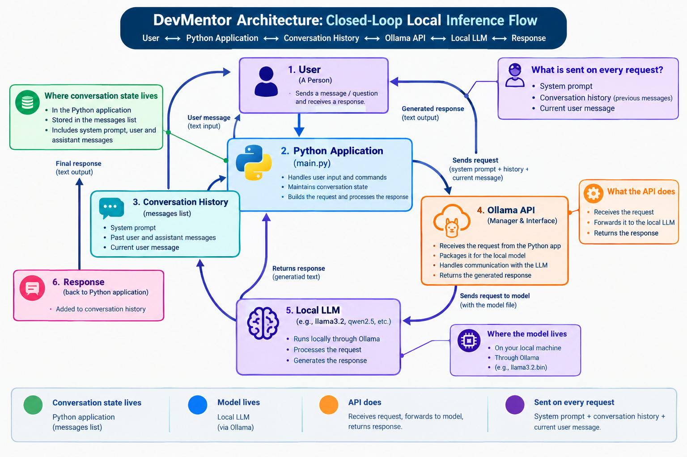

### DevMentor AI Assistant

## Description

DevMentor is a local conversational AI assistant that is built and designed to help junior developers understand anything and everything proramming including solving coding problems depending on your level of understanding. 
This application is built in python and runs fully locally through Ollama. It follows system prompts which helps to define its role as an assistant and its explanation style while keeping the history of the conversions in case of later requests. It also survives simple errors without crashing or dumping a traceback on the screen.
DevMentor does not rely on external AI APIs. The language model runs locally through Ollama.

## Features

- Local conversational AI using Ollama
- System prompt
- Conversation history/context
- Dynamic input
- /reset
- /history
- /exit
- Empty input handling
- Checks if Ollama is running
- Displays local models
- Handles connection/request errors

## Architecture

DevMentor follows a simple local client-server architecture:

User → Python Application → Conversation History → Ollama API → Local LLM → Response

- **User:** Enters questions or commands through the terminal.
- **Python Application:** Receives the user's input, manages commands and conversation history and sends requests to Ollama.
- **Conversation History:** The conversation is stored in the Python application's messages list. User and assistant messages are kept and sent as context with each chat request.
- **Ollama API:** Acts as the local API between the Python application and the language model.
- **Local LLM:** The selected model runs locally through Ollama and generates the response.
- **Response:** The generated response is returned to the Python application and displayed to the user.

The model runs locally on the user's computer. The application state and conversation history are managed by the Python application.

## Installation

# Requirements

- Python 3.11.16
- Ollama
- `llama3.2:latest`

# Python Environment

Create and activate a virtual environment:

```bash
python3 -m venv .venv
source .venv/bin/activate
```

# Running the application

After completing the installation, run:

```bash
python main.py 
```

## System Prompt

DevMentor uses a system prompt to define the assistant's identity, target audience, goals, explanation style and behaviour when it is unsure of an answer.

The system prompt is stored separately in `prompts.py` and is included as the first message in the conversation history.

The prompt defines DevMentor as a programming assistant for junior developers. It instructs the assistant to:

- Explain concepts in plain and simple language.
- Break difficult topics into smaller steps.
- Use short, concise, and practical examples.
- Avoid assuming advanced programming knowledge.
- Be patient and clear.
- Explain the idea before providing code.
- Use the programming language requested by the user.
- Use Python by default when no language is specified.
- Clearly state when it is unsure instead of making up an answer.

During testing, the prompt was also tested with follow-up questions about recursion to see whether the assistant could adapt its explanation when the initial explanation was not understood.

## Conversation Memory

DevMentor maintains conversation memory using a Python list called 'messages'.

The list begins with the system prompt:

messages = [
    {"role": "system", "content": SYSTEM_PROMPT}
]

When the user sends a message, it is added to the messages list. The application then sends the complete list to Ollama when making the chat request. After Ollama generates a response, the assistant's response is also added to the list.

This allows previous messages to be sent as context with later requests which allows multi-turn conversations.

- The /reset command clears the existing conversation messages and adds the system prompt again:

messages.clear()
messages.append(
    {"role": "system", "content": SYSTEM_PROMPT}
)

After a reset, the previous user and assistant messages are no longer part of the conversation.

- The /history command displays the user and assistant messages stored in the current conversation.

The system prompt is excluded from the displayed history:

messages_to_show = messages[1:]

This removes the first item in the list, which is the system prompt.

- After /reset, there are no user or assistant messages to display until a new message is entered.

# Error Handling

DevMentor includes basic error handling so that common problems do not cause the application to crash with a raw traceback.

# Ollama Connection Check
Before starting the chat, the application checks whether Ollama is available using the /api/tags endpoint.

This prevents the application from entering the chat loop when the Ollama service is unavailable.

# Empty Input

If the user submits an empty message, the application displays: Please enter a message.


# Connection and API Errors
Errors that occur while communicating with Ollama are handled using try/except blocks.

Connection errors display: ERROR: Could not connect to Ollama.

Other request-related errors display an API error message without showing a raw Python traceback.

If a request fails after a user message has been added to the conversation, the application removes that message so that an unsuccessful request does not remain in the conversation history.

## Commands

| Command | Description |
|---|---|
| `/reset` | Clears the conversation history |
| `/history` | Shows the current conversation |
| `/exit` | Exits the application |


## Project Structure
DevMentor/
├── main.py
├── prompts.py
├── config.py
├── requirements.txt
├── README.md
└── images/
    └── architecture.png

## Application Flow

The application works by:

Starting the Python application.
Checking if Ollama is running.
Initializing the messages list with the system prompt.
Receiving user input.
Checking for commands or empty input.
Adding the user message to the conversation history.
Sending the conversation history to Ollama.
Receiving the response from the local LLM.
Adding the assistant response to the conversation history.
Displaying the response to the user.
Waiting for the next message.

The process continues until the user enters /exit.

## Prompt Experiment

The prompt experiment was used to investigate how different system prompts affect the behaviour and responses of the same local language model.
Three system prompts were tested:

| Prompt | Description |
|---|---|
| `Prompt A` | A minimal prompt that only defines the assistant as a programming assistant. |
| `Prompt B` | Adds instructions about helping junior developers, using simple explanations, breaking difficult topics into smaller steps and providing practical examples. |
| `Prompt C` | Adds more specific behavioural constraints including explaining the concept before showing code, keeping introductions short, breaking complex explanations into smaller steps and using Python by default. |

The same three questions were used with each prompt:
Explain REST APIs.
Explain recursion.
What is dependency injection?Show me an example.

The experiments were run using the same local Ollama model so that the main variable being investigated was the system prompt.
The results were compared based on:

Which prompt was most useful, and why?
What differences were observed between the responses?
Did adding more instructions always improve the responses?
Which instructions appeared to have the greatest effect on the assistant's behaviour?
What happened when an instruction was vague?

# My Observations
Prompt A  responses were detailed and structured but the explanations felt too advanced. The model provided a lot of information and explained the concepts as if the user already had some programming knowledge. There was a lot happening in the responses which made them feel more complicated than necessary for a beginner. You can easily get lost with Prompt A.

Prompt B explanations were easier to understand and more suitable for a junior developer. The responses were clear, friendly and well structured. The model followed the instructions closely without doing too much or too little. The explanations introduced concepts in a simple way and used practical examples where appropriate.

Prompt C responses were shorter and more precise. Its definitions were quite similar to Prompt A but the responses were more controlled because of the constraints. However, keeping introductions short and following specific rules did not result in the type of explanation preferred by a beginner. The responses were concise but they did not provide the same teaching style as Prompt B.

1. Which prompt was most useful, and why?
Prompt B was most useful because it matched what DevMentor was made for which is to help junior developers. Its explanations felt like the user is beight taught rather than just explaining like prompt A. It was easy to follow the explanation without getting lost or fed up.

2. What differences were observed between the responses?
Prompt A was more open which resulted in longer and more detailed responses. However, the responses could feel advanced and overwhelming for a beginner.

Prompt B focused on the learner and how the information should be explained. This resulted in clearer, simpler and more beginner-friendly responses.

Prompt C was more on controlling the structure and length of the responses. This made the answers concise but they were not totally explanatory.

3. Did adding more instructions always improve the responses?
Adding more instructions did not automatically make the responses better. Prompt B gave instructions , same did prompt C but I realized that unless the instructions are relevant and focus on the intended audience, they may not produce the type of response the user needs. This showed me that the quality of instructions matters more than simply adding more of them.

4. Which instructions appeared to have the greatest effect on the assistant's behaviour?
- The use of practical examples
- Concepts should be explained in simple and clear language
- Not assuming the user already has programming knowlege and 
- The assistant should help junior developers

5. What happened when an instruction was vague?
When an instruction is vague like prompt A, it allows the assistant to be free in explanations and gives explanations without considering ones level of knowledge. Giving clear instructions redefines how the assistant responds to a question from the user.


## Memory Investigations

The memory investigation was used to determine how conversation memory works in DevMentor and whether the local language model independently remembers information from previous requests using two tests.

- Test one  started with the statement: My favorite programming language is Python.
The conversation then continued with:
Explain interfaces.
and finally: What is my favorite programming language?

The same messages list was used throughout the conversation. Each new user message was added to the list before the request was sent to Ollama and because the previous messages remained in the conversation history, the model received the earlier statement about Python as part of the context for the final question.

The model's response to the final question included: You mentioned that your favorite programming language is Python.

This showed that the model could use information from the earlier message because the previous conversation history was still included in the context sent to Ollama.

- For Test two,a new messages list was created containing only the system prompt:
messages = [
    {
        "role": "system",
        "content": SYSTEM_PROMPT
    }
]
The application then asked:
What is my favorite programming language?
The earlier message stating that Python was the favorite programming language was not included in the request sent to Ollama.

The observed response was: I'm happy to help you, but I have to ask, I don't have any information about your favorite programming language. We just started our conversation, and I don't have any context about your programming experience or interests. Can you please tell me what your favorite programming language is? Or maybe you're not sure, and that's okay too! We can explore different languages together, and I can help you learn about them.

This experiment shows that the LLM does not independently remember the conversation between requests. What appears to be memory is managed by the Python application.

Application state:
The Python application maintains the current conversation in the messages list. This list contains the system prompt and the user and assistant messages that have been added during the conversation.

Message history:
The previous messages remain in the messages list. This message history allows DevMentor to track what has been discussed so it can use past information in later responses.

Context sent on each request:
Whenever the application sends a request to Ollama, it sends the relevant contents of the messages list along with the new user message. The LLM then responds using information from previous messages because that information is included in the context it receives.

In test one, the earlier messages remained in the messages list which made it easy for the model to identify Python as the favorite programming language. In test two, a new messages list containing only the system prompt was created. The earlier statement about Python was not included in the context sent to Ollama so the model stated that it did not have that information.

This shows that DevMentor's conversation memory is application-managed state and message history. The LLM generates each response from the context provided to it rather than independently maintaining the entire conversation.

## Challenge Questions
1. Why does the app send previous messages to the LLM?
The app sends previous messages so the LLM has the context of the conversation. Without the previous messages, the model would not know what was discussed earlier in the conversation. This is for conversation memory.
2. What is the difference between system, user, and assistant messages?
- System: Defines the assistant's role, behaviour and instructions.
- User: Contains the messages or questions entered by the user.
- Assistant: Contains the responses generated by the LLM.
3. If you close Python and restart, why does the assistant "forget"?
The conversation history is stored in the Python application's messages list. When Python is closed, that list is lost and  when the application starts again, a new conversation starts with only the system prompt.
4. Is memory stored inside the LLM or inside your application? Explain.
For this application(DevMentor), memory is managed by the Python application. The application stores the conversation in the messages list and sends that history to the LLM with each request. The LLM will then use the context it receives rather than independently storing the conversation.
5. What happens when the conversation becomes extremely long? Research the term context window.
A context window is the maximum amount of text measured in tokens that an LLM can consider at one time. I realized that if the conversation becomes longer than the model's context window, the application may need to truncate or summarize older messages so that the relevant conversation can still fit.
6. Why is You are helpful. a weak system prompt? How would you improve it?
You are helpful is weak because it does not explain who the assistant is, how it should provide answers or who it is helping.
I would improve it by being specific with the system prompt. That is, the rules it should follow, the target audience and behaviour.
7. After the LLM replies, what should happen to messages before the next user turn, and why?
The assistant's response should be added to the messages list before the next user message. This keeps both conversations in the history so the LLM receives the complete context of the previous interaction.This way, the next user message will be answered in the context of the conversation.

## Architecture


